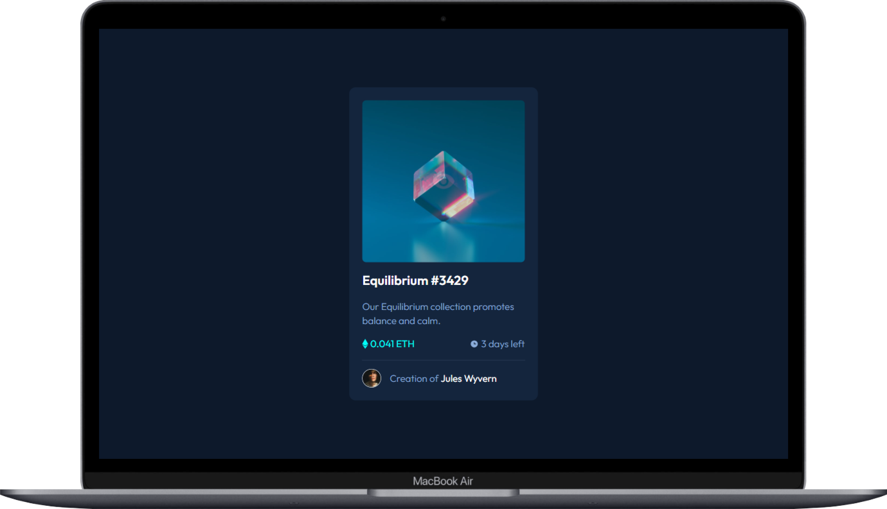

# NFT preview card component solution

## Table of contents

- [Overview](#overview)
  - [The challenge](#the-challenge)
  - [Screenshot](#screenshot)
  - [Links](#links)
- [My process](#my-process)
  - [Built with](#built-with)
  - [What I learned](#what-i-learned)

## Overview

### The challenge

Users should be able to:

- View the optimal layout depending on their device's screen size
- See hover states for interactive elements

### Screenshot



### Links

- Solution URL: [NFT preview card component](https://github.com/OungHongly/NFT-preview-card-component.git)
- Live Site URL: [NFT-preview-card-component](https://ounghongly.github.io/NFT-preview-card-component/)

## My process

### Built with

- Semantic HTML5 markup
- CSS custom properties
- Flexbox

### What I learned

- I face with the challenge of hover state on image that show overlay background with view icon
- And this is my solution to that:

```HTML
      <div class="group-image">
          
        <div class="overlay">
          
        </div>
      </div>
```

```CSS
  .group-image {
  border-radius: var(--space-sm);
  overflow: hidden;
  position: relative;
  }
  .group-image img {
    width: 100%;
    display: block;
  }
  .overlay {
    position: absolute;
    width: 100%;
    height: 100%;
    background-color: var(--Cyan-400);
    top: 0;
    right: 0;

    display: flex;
    justify-content: center;
    align-items: center;
    opacity: 0;
    transition: 0.3s;
    cursor: pointer;
  }
  .overlay img {
    width: 45px;
    height: auto;
  }
  .group-image:hover .overlay {
    opacity: 1;
    background-color: rgba(0, 255, 247, 0.4);
  }
```
